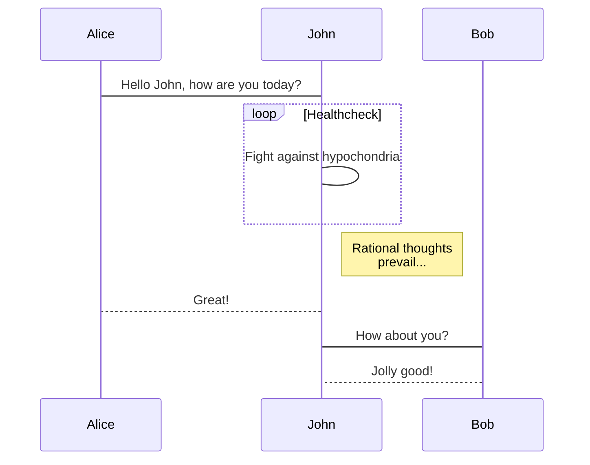
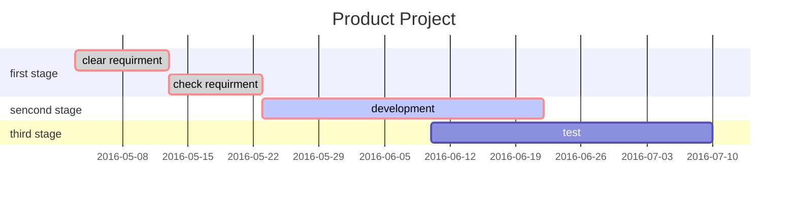

#### 一、测试中文及常用中文标点显示

​    这是一段中文文字，用来测试中文显示和各种常见中文标点，如：逗号（，）、冒号（：）、感叹号（！）、省略号（……）、句号（。）、以及各种特殊字符（@#￥%&*）。

#### 二、测试英文字母及英文标点

​    This's an english paragraph to test the effects of english letters and punctuation.

abcdefghijklmnopqrstuvwxyz 1234567890

,./;'[]'!@#\$%^&*()-=_+\${}:""<>?

#### 三、测试Markdown语法

##### 3.1 内置引用

> 引用的文档内容是这样的
>
> 效果看看好不好

##### 3.2 语法高亮

```python
import sys
import io

def add(x,y):
    return x+y
def main():
    a, b = map(int, input('input two num to add:').split())
    print(add(a, b))
if __name__ == '__main__'
    main()
```

##### 3.3 表格

header 1 | header 2
--|--
row1 col1 | row1 col2
row2 col1 | row2 col2

#####  3.4 粗体、斜体以及分割线

**这是粗体**

***

*这是斜体*

##### 3.5 列表

###### 3.5.1 无序列表

- 列表1
    - 列表1.1
    - 列表1.2
- 列表2
    - 列表2.1
    - 列表2.2
- 列表3

###### 3.5.2 有序列表

1. 列表1
   1. 列表1.1
   2. 列表1.2
2. 列表2
3. 列表3

##### 3.6 制作勾选框（To-do List)

- [x] 已完成项1
    - [x] 已完成项目1.1
- [ ] 未完成项1
- [ ] 未完成项2

#### 四、mermaid插件支持的markdown语法

##### 4.1 流程图


##### 4.2 序列图


##### 4.3 甘特图




#### 五、 数学公式（mathjax）

**Mathematical formula  $y=x^2$**

> Inline Math:  $\dfrac{\tfrac{1}{2}[1-(\tfrac{1}{2})^n] }{1-\tfrac{1}{2} } = s_n$

Math block

$$
\boxed{\oint_C x^3\, dx + 4y^2\, dy}
$$

$$
2 = \left(\frac{\left(3-x\right) \times 2}{3-x}\right)
$$

$$
\sum_{m-1}^\infty\sum_{n-1}^\infty\frac{m^2\,n}{3^m(m\,3^{n+m}+n\,3^m)}
$$

$$
\begin{pmatrix}
a & b\\\\
c & d\\\\
\\hline
1 & 0\\\\
0 & 1
\end{pmatrix}
$$

#### 六、 插入图片
<center></center>


